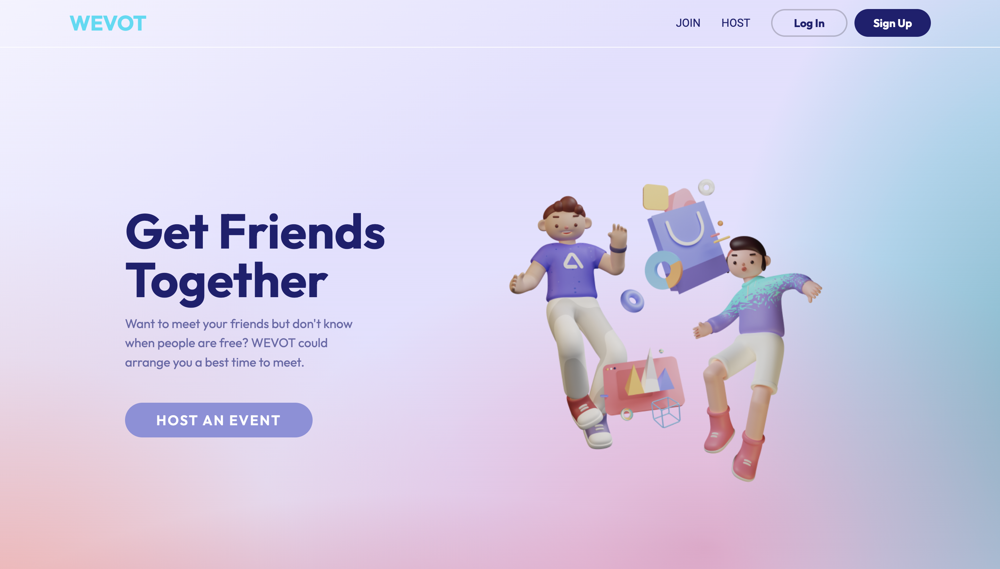
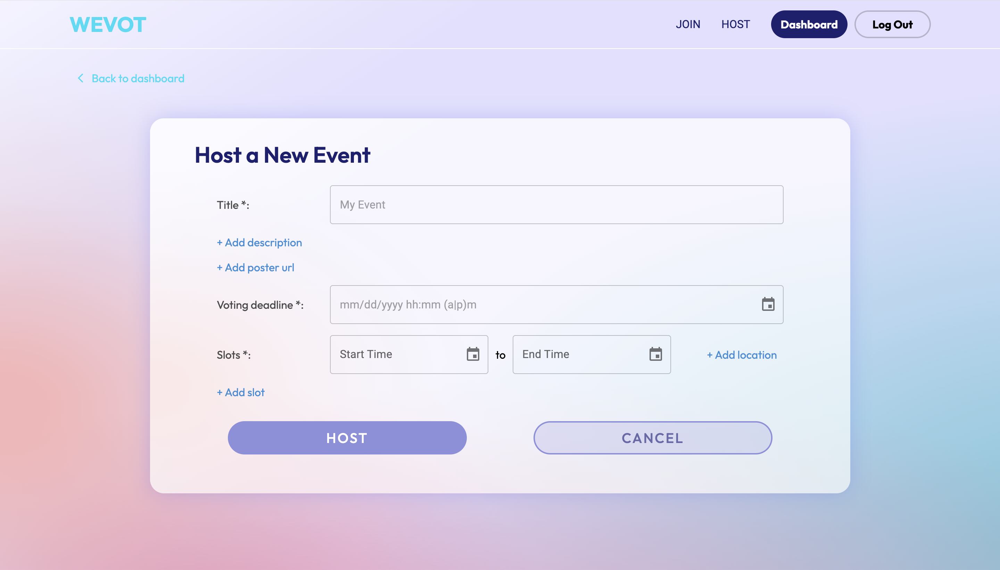

# WeVot

This app is deployed at [https://wevot.netlify.app/](https://wevot.netlify.app/)

An event scheduling app for people who want to meet up but find it hard deciding a time that suits the most participants.

A user can create an event with multiple potential time slots and invite their fiends to vote on their preferred slot.

## Table of contents

- [WeVot](#wevot)
  - [Table of contents](#table-of-contents)
  - [General info](#general-info)
  - [Technologies](#technologies)
  - [Run this project locally](#run-this-project-locally)
  - [How to use the app](#how-to-use-the-app)
    - [To host an event](#to-host-an-event)
    - [To join an event](#to-join-an-event)

## General info

This is the client repository for WeVot app. You can find the [server repository](https://github.com/ning905/Wevot-server) here.

This project is built for the Boolean Course as the final personal project.

## Technologies

Project is created with:

React, JavaScript, Scss, Material UI, Axios

## Run this project locally

1. Fork this repository and clone the fork to your machine.
2. `npm install`
3. `npm start`
4. Fork the [server repository](https://github.com/ning905/Wevot-server) and follow the instructions.

## How to use the app

### To host an event

1. If you already have an account, simply log in your account, and skip step 2 and 3.
2. Sign up to create an account.  You will receive a verification email after your account is created.  Your account must be verified before you can login in.
3. Click the link in the email and verify your account. Once it is verified successfully, you will be able to view your dashboard.
4. Click the "HOST AN EVENT" button and create your event with details. Feel free to add more time slots if needed. You can also choose to provide location information for your slots. 
5. After the event has been created, you can share the event with your friends either via link or event code.

### To join an event

1. To join by link, simply paste the link you received to your browser.  To join by event code, visit the website and click the "JOIN AN EVENT" button on the home page or navigation bar. Paste the event code into the input field.
2. Enter your email address so we can recognize your vote and notify you if the host updates the event. You can choose to leave your name so other participants may recognize you.
3. Select your preferred slots and click submit. You can withdraw and submit new ones before the voting deadline.
